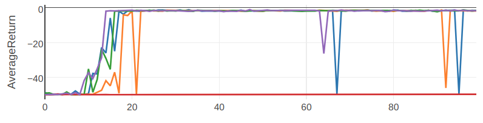
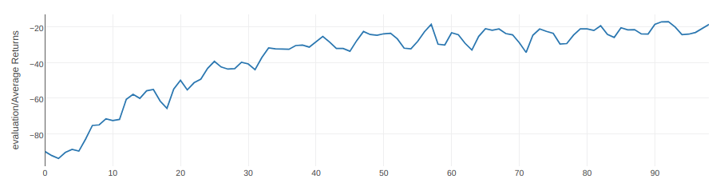

# Hindsight Experience Replay
Some notes on the implementation of
[Hindsight Experience Replay](https://arxiv.org/abs/1707.01495).
## Expected Results
If you run the [Fetch example](examples/her/her_td3_gym_fetch_reach.py), then
 you should get results like this:
 

If you run the [GridWorld example](examples/her/her_dqn_gridworld.py)
, then you should get results like this:
 

Note that these examples use HER combined with DQN and SAC, and not DDPG.

These plots are generated using [viskit](https://github.com/vitchyr/viskit).

## Goal-based environments and `ObsDictRelabelingBuffer`
[See here.](goal_based_envs.md)

## Implementation Difference
This HER implemention is slightly different from the one presented in the paper.
Rather than relabeling goals when saving data to the replay buffer, the goals
are relabeled when sampling from the replay buffer.

In other words, HER in the paper does this:

    Data collection
        1. Sample $(s, a, r, s', g) ~ \text\{ENV}$.
        2. Save $(s, a, r, s', g)$ into replay buffer $\mathcal B$.
        For i = 1, ..., K:
            Sample $g_i$ using the future strategy.
            Recompute rewards $r_i = f(s', g_i)$.
            Save $(s, a, r_i, s', g_)$ into replay buffer $\mathcal B$.
    Train time
        1. Sample $(s, a, r, s', g)$ from replay buffer
        2. Train Q function $(s, a, r, s', g)$

The implementation here does:

    Data collection
        1. Sample $(s, a, r, s', g) ~ \text\{ENV}$.
        2. Save $(s, a, r, s', g)$ into replay buffer $\mathcal B$.
    Train time
        1. Sample $(s, a, r, s', g)$ from replay buffer
        2a. With probability 1/(K+1):
            Train Q function $(s, a, r, s', g)$
        2b. With probability 1 - 1/(K+1):
            Sample $g'$ using the future strategy.
            Recompute rewards $r' = f(s', g')$.
            Train Q function on $(s, a, r', s', g')$

Both implementations effective do the same thing: with probability 1/(K+1), 
you train the policy on the goal used during rollout. Otherwise, train the 
policy on a resampled goal.

