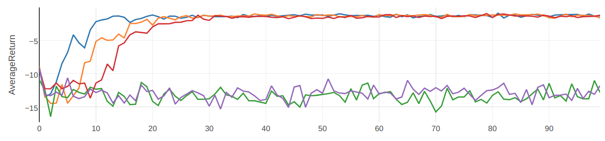

# Hindsight Experience Replay
Some notes on the implementation of
[Hindsight Experience Replay](https://arxiv.org/abs/1707.01495).
## Expected Results
If you run the [Fetch example](examples/her/her_td3_gym_fetch_reach.py), then
 you should get results like this:
 
 
If you run the [Sawyer example](examples/her/her_td3_multiworld_sawyer_reach.py)
, then you should get results like this:
 
 
Note that these examples use HER combined with TD3, and not DDPG.
TD3 is a new method that came out after the HER paper, and it seems to work 
better than DDPG.

## Goal-based environments and `ObsDictRelabelingBuffer`
Some algorithms, like HER, are for goal-conditioned environments, like 
the [OpenAI Gym GoalEnv](https://blog.openai.com/ingredients-for-robotics-research/)
or the [multiworld MultitaskEnv](https://github.com/vitchyr/multiworld/) 
environments.

These environments are different from normal gym environments in that they 
return dictionaries for observations, like so: the environments work like this:

```
env = CarEnv()
obs = env.reset()
next_obs, reward, done, info = env.step(action)
print(obs)

# Output:
# {
#     'observation': ...,
#     'desired_goal': ...,
#     'achieved_goal': ...,
# }
```
The `GoalEnv` environments also have a function with signature
```
def compute_rewards (achieved_goal, desired_goal):
   # achieved_goal and desired_goal are vectors
```
while the `MultitaskEnv` has a signature like
```
def compute_rewards (observation, action, next_observation):
   # observation and next_observations are dictionaries
```
To learn more about these environments, check out the URLs above.
This means that normal RL algorithms won't even "type check" with these 
environments.

`ObsDictRelabelingBuffer` perform hindsight experience replay with 
either types of environments and works by saving specific values in the 
observation dictionary.

## Implementation Difference
This HER implemention is slightly different from the one presented in the paper.
Rather than relabeling goals when saving data to the replay buffer, the goals
are relabeled when sampling from the replay buffer.


In other words, HER in the paper does this:

    Data collection
        1. Sample $(s, a, r, s', g) ~ \text\{ENV}$.
        2. Save $(s, a, r, s', g)$ into replay buffer $\mathcal B$.
        For i = 1, ..., K:
            Sample $g_i$ using the future strategy.
            Recompute rewards $r_i = f(s', g_i)$.
            Save $(s, a, r_i, s', g_)$ into replay buffer $\mathcal B$.
    Train time
        1. Sample $(s, a, r, s', g)$ from replay buffer
        2. Train Q function $(s, a, r, s', g)$

The implementation here does:

    Data collection
        1. Sample $(s, a, r, s', g) ~ \text\{ENV}$.
        2. Save $(s, a, r, s', g)$ into replay buffer $\mathcal B$.
    Train time
        1. Sample $(s, a, r, s', g)$ from replay buffer
        2a. With probability 1/(K+1):
            Train Q function $(s, a, r, s', g)$
        2b. With probability 1 - 1/(K+1):
            Sample $g'$ using the future strategy.
            Recompute rewards $r' = f(s', g')$.
            Train Q function on $(s, a, r', s', g')$

Both implementations effective do the same thing: with probability 1/(K+1), 
you train the policy on the goal used during rollout. Otherwise, train the 
policy on a resampled goal.

