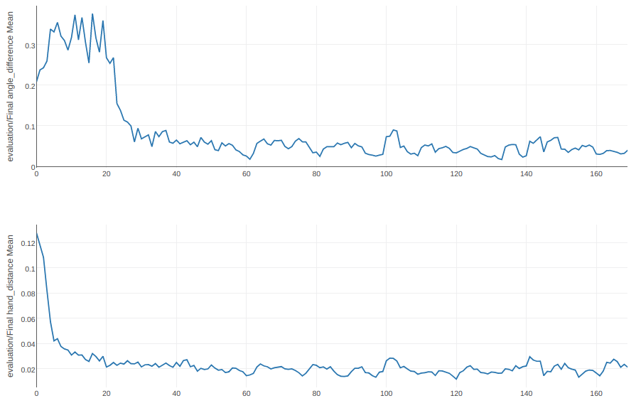
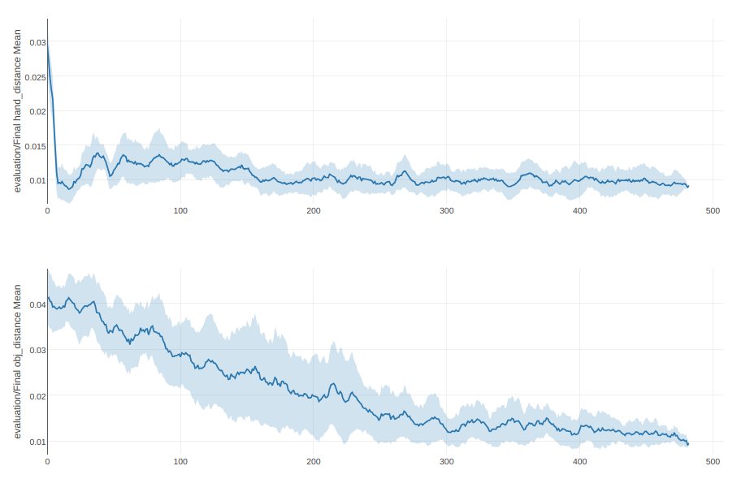
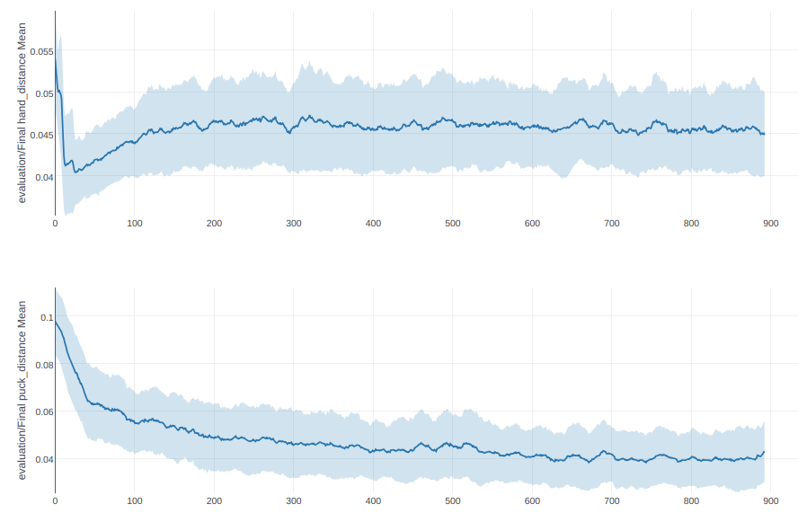

# Skew-Fit
Requires [multiworld](https://github.com/vitchyr/multiworld) to be installed:
```
pip install git+https://github.com/vitchyr/multiworld.git@f711cdb
```

Implementation of Skew-Fit. For more information:
 - [Videos](https://sites.google.com/view/skew-fit)
 - [arXiv](https://arxiv.org/abs/1903.03698)

To reproduce the results, use these library versions as the performance seems to depend on the library version:
 -  multiworld: f711cdb (git hash)
 - python: 3.5.2
 - torch: 0.4.1.post2
 - mujoco_py: 1.50.1.59
 - gym: 0.10.5

Here are the results you should expect from each script.
These plots are generated with [viskit](https://github.com/vitchyr/viskit) 
with smoothing on.

Note that [RIG](RIG.md) is a special-case of Skew-Fit with `power=0`.


[examples/skewfit/sawyer_door.py](../examples/skewfit/sawyer_door.py). 1 Seed:


[examples/skewfit/sawyer_pickup.py](../examples/skewfit/sawyer_pickup.py). 3 Seeds:


[examples/skewfit/sawyer_pusher.py](../examples/skewfit/sawyer_pusher.py). 9 Seeds:

